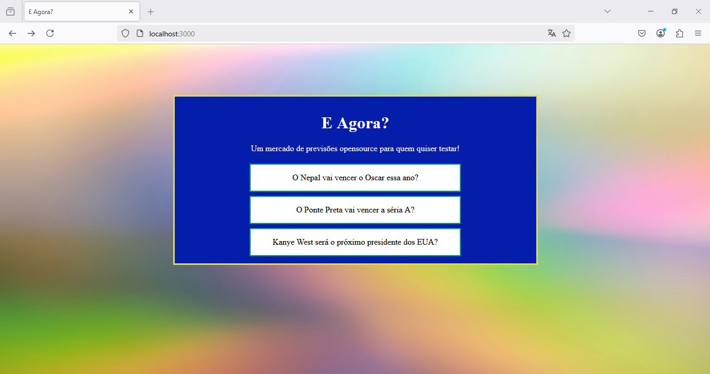

# E Agora?

O "E agora?" é uma interface web para interagir com os contratos de predição do projeto [simple-prediction-market](https://github.com/joaopedrolourencoaffonso/simple-prediction-market).

O projeto ainda está em andamento, abaixo, uma lista de metasa atingidas e a serem desenvolvidas:

- [x] Contrato de predição simples com mais de 95% de cobertura.
- [x] Interface gráfica simples que permita visualizar uma listagem das previsões em andamento.
- [x] Interface gráfica que permita ao usuário visualizar detalhes das previsões e votar nas mesmas.
- [ ] Contrato de predição mais avançado, que crie contratos diferentes para cada previsão, com mais de 95% de cobertura.
- [ ] Contrato de predição baseado em recompensa invés de apostas com mais de 95% de cobertura.
- [ ] Adaptar interface gráfica para interagir com os novos tipos de contratos
- [ ] Adaptar interface gráfica para permitir o registro de novas previsões
- [ ] Interface gráfica que permita aos juízes:
    - [ ] Ver detalhes de uma previsão
    - [ ] Encerrar previsão
    - [ ] Ver lista de investidores na previsão
    - [ ] Realizar os pagamentos
- [ ] Script para instalação automátizada

# Dependências

- carteira Metamask instalada e configurada para se conectar a uma rede Hardhat local, preferencialmente, utilize a conta "0xf39Fd6e51aad88F6F4ce6aB8827279cffFb92266" pois ela recebe tokens durante o processo de deploy.
- Versão mais recente do Hardhat Instalada na máquina
- Node versão 18 ou mais recente

# Estado atual do aplicativo

Primeiro, clone o repositório [simple-prediction-market](https://github.com/joaopedrolourencoaffonso/simple-prediction-market) e instale as dependências

```bash
$ git clone https://github.com/joaopedrolourencoaffonso/simple-prediction-market.git
```

Acesse o repositório  e inicialize o nó. Caso já tenha executado no passado, utilize o comando `clean` para limpar o estado da máquina:

```bash
$ npx hardhat clean
$ npx hardhat node
```

Abra uma nova linha de comando e acesse o repositório `simple-prediction-market` novamente. Execute o script `deploy-MercadoSimples.js`, ele não apenas realizará o deploy dos contratos necessários como também cadastrará previsões e votos:

```bash
$ npx hardhat run ./scripts/deploy-MercadoSimples.js --network localhost
Compiled 25 Solidity files successfully (evm target: paris).
address MyToken:  0x5FbDB2315678afecb367f032d93F642f64180aa3
Mercado simples:  0xe7f1725E7734CE288F8367e1Bb143E90bb3F0512
Eleitor  1  votou  300  na predição 1
Eleitor  2  votou  300  na predição 1
Eleitor  3  votou  400  na predição 1
Eleitor  4  votou  1000  na predição 1
Eleitor  5  votou  400  na predição 
...
```

Agora, abra uma nova linha de comando e clone o repositório do "E Agora?":

```bash
$ git clone https://github.com/joaopedrolourencoaffonso/e-agora.git
```

Instale os pacotes:

```bash
$ npm install --legacy-peer-deps
```

> _O projeto usa uma versão antiga do ethers.js pois não consegui utilizar a versão 6._

Agora, execute os comandos abaixo para dispobilizar o Chart.js e o ether.js no frontend.

```bash
$ cp ./node_modules/chart.js/dist/chart.umd.js ./public/javascript/.
$ cp ./node_modules/chart.js/dist/ethers.esm.js ./public/javascript/.
```

Por fim, basta inicializar a aplicação:

```bash
$ npm run start

> e-agora@1.0.0 start
> node app.js

Server running at http://localhost:3000
```

Acessando http://localhost:3000 você verá uma tela similar a abaixo:



Clicando na primeira previsão:


Para votar, basta escolhar sua opção de voto e digitar o valor:


Após clicar em "Ok", autorize as transações pela metamask e o voto será registrado automáticamente, um alerta com as hashs de transação será exibido:


Recarregue a página para ver o novo estado da votação:


## Copiando arquivos de ABI

Caso você edite os contratos, será necessáerio atualizar os arquivos binários na pasta `public`. Use o comando abaixo:

```sh
> cp ../simple-prediction-market/artifacts/contracts/token.sol/MyToken.json ./public/json/.
> cp ../simple-prediction-market/artifacts/contracts/MercadoSimples.sol/MercadoSimples.json ./public/json/.
```

## Migrando do ethers v5 para o v6

Utilizar a versão 6 do ether.js acarretou dificuldades além do escopo do projeto, motivo pelo qual retornei para a versão 5. Caso deseje atualizar o projeto para a versão 6, veja [AQUI](https://docs.ethers.org/v6/migrating/#migrate-providers) para orientações.

## Observação

**A legalidade de mercados de predição no Brasil ainda é questionável. O presente projeto tem fins meramente educacionais e exemplificativos.**

# Agradecimentos

Foto de fundo da tela de previsão fornecida por <a href="https://unsplash.com/pt-br/@seanwsinclair?utm_content=creditCopyText&utm_medium=referral&utm_source=unsplash">Sean Sinclair</a> na <a href="https://unsplash.com/pt-br/fotografias/yellow-and-white-abstract-painting-gai1YB3UmDA?utm_content=creditCopyText&utm_medium=referral&utm_source=unsplash">Unsplash</a>

      